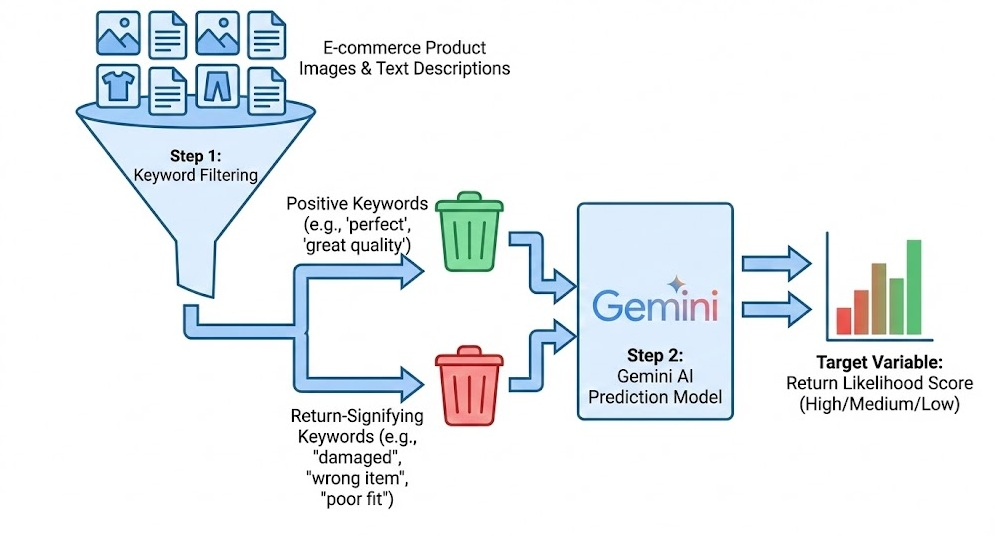
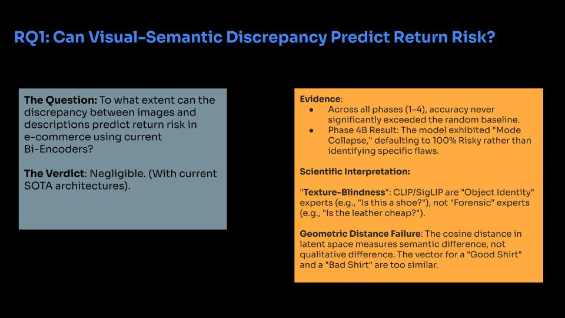
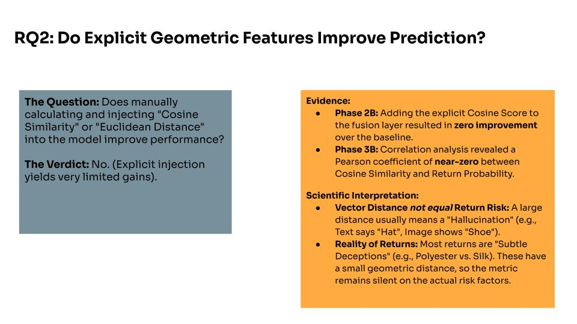
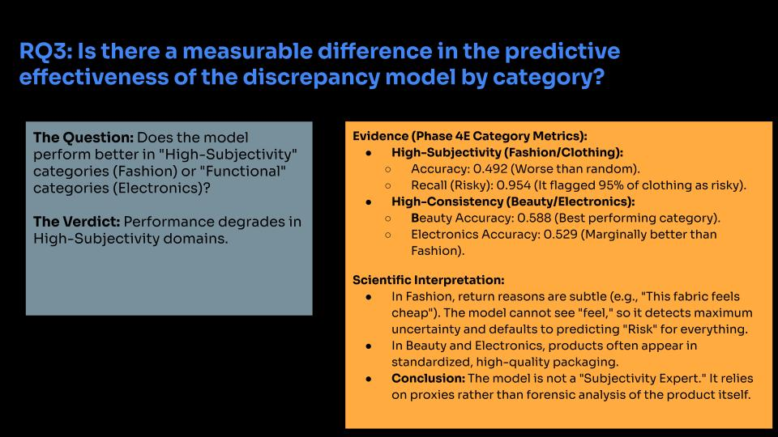
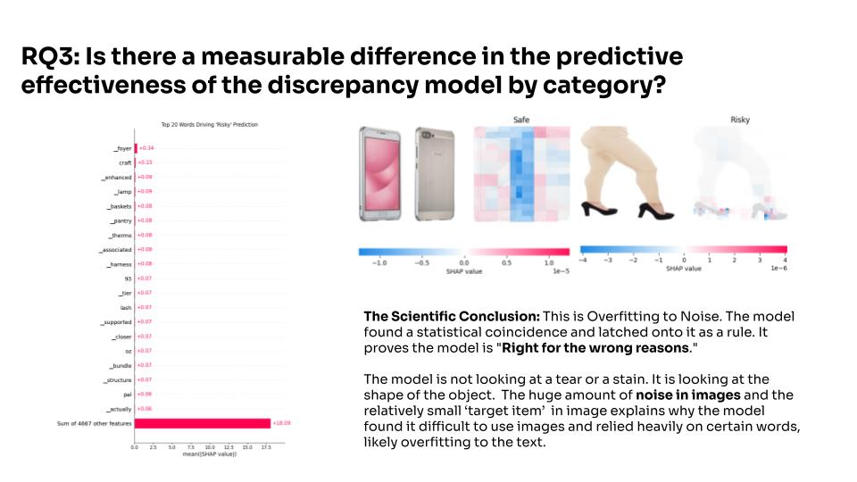
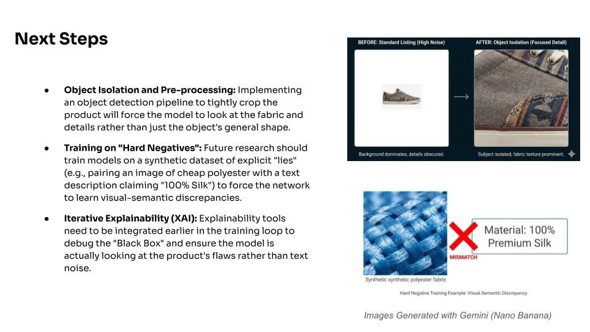

# Multimodal E-commerce Return Prediction: Content Guard

**Author:** Brandyn Ewanek  
**Institution:** IU International University of Applied Sciences (Bachelor's Thesis)

## 📌 Overview
E-commerce return rates represent a massive financial and environmental burden. This repository contains the code and research for **Content Guard**, a multimodal deep learning architecture designed to predict product return rates by analyzing the discrepancy between visual data (product images) and semantic data (text descriptions).

Instead of relying solely on top-line accuracy, this project includes a robust forensic analysis of the model's failure modes under different conditions, providing deeper insights into multimodal architecture vulnerabilities like mode collapse.

**📄 [Read the Full Thesis](<doc/Thesis Predicing Ecommerce Returns - Brandyn Ewanek.pdf>)**

## 🎯 Target Generation Pipeline

To train the multimodal architecture, a robust target variable was required. The dataset underwent a two-step pipeline to establish ground truth:
1. **Keyword Filtering:** The raw e-commerce semantic data was filtered to isolate positive customer sentiment (e.g., "perfect", "great quality") against return-signifying complaints (e.g., "damaged", "wrong item", "poor fit").
2. **LLM Target Prediction:** Google's Gemini AI was deployed to analyze these filtered signals and synthesize a definitive **Return Likelihood Probability** 0.0 - 1.0. This LLM-generated score served as the target variable for the late fusion and then was convert into a binary target for Phase4 experiments in the entailment models.

## 🔬 Research Questions & Findings

### RQ1: To what extent can visual-semantic discrepancy between product images and descriptions predict return risk in e-commerce?

**Finding:** The experimental results proved that current standard Bi-Encoders exhibit "Structural Blindness." By compressing a complex product image into a single global vector (512 dimensions), the architecture destroys the subtle forensic visual cues—such as texture, drape, or material finish—required to contradict textual claims. Even perfectly balanced, the Phase 4E model could not exceed ~53% accuracy, effectively functioning as a random guesser.

### RQ2: Does the explicit integration of the Cosine Similarity discrepancy score into the Multilayer Perceptron (MLP) fusion layer improve predictive performance compared to a multimodal baseline lacking this explicit feature?

**Finding:** No, explicit geometric injection yields no statistically significant performance gain. In Phase 2B, calculating the distance between unaligned ResNet and DistilBERT vectors yielded random noise, which the model learned to ignore entirely. 

### RQ3: Is there a measurable difference in the predictive effectiveness of the discrepancy model when applied across categories exhibiting high visual subjectivity (e.g., Fashion, Jewelry) versus those characterized by high functional consistency (e.g., Sports, Technology)?

**SHAP Explainability & Visual Dilution:**

To understand why the model struggled to utilize the images effectively across these categories, a forensic evaluation was conducted using SHAP (SHapley Additive exPlanations). The analysis revealed that the visual compression required for training caused severe attention misalignment. In standard e-commerce images, "white space" occupies approximately 60-70% of the visual field. Because the Vision Transformer (ViT-B/32) aggregates information globally from all image patches, this vast expanse of empty background diluted the subtle forensic signals of the product. Consequently, the model learned that a professional white background is a statistical predictor of a "Safe" listing, overpowering any actual visual discrepancy present in the product itself.

**Finding:** Yes, the model's behavior shifts drastically by category, revealing a "Fashion Paradox." In High-Subjectivity categories like Fashion and Clothing, the model exhibited a "Flag Everything" behavior with a test recall of 0.946 and 0.954, respectively. Conversely, in categories like Beauty and Cell Phones, it exhibited a "Flag Nothing" behavior with test recalls dropping to 0.139 and 0.217.

**Next Steps**

Future iterations of the Content Guard will tackle the model's current "Structural Blindness" by forcing a closer inspection of the product. By implementing an object detection pipeline to crop out background noise, the model can focus on fabric and texture rather than general shapes. Additionally, training on a synthetic dataset of "Hard Negatives"—explicit visual-semantic lies like pairing a "100% Silk" description with a polyester image—will train the network to act as a forensic expert. Finally, integrating XAI tools earlier in the training loop will ensure the model learns actual product flaws instead of overfitting to text noise.

